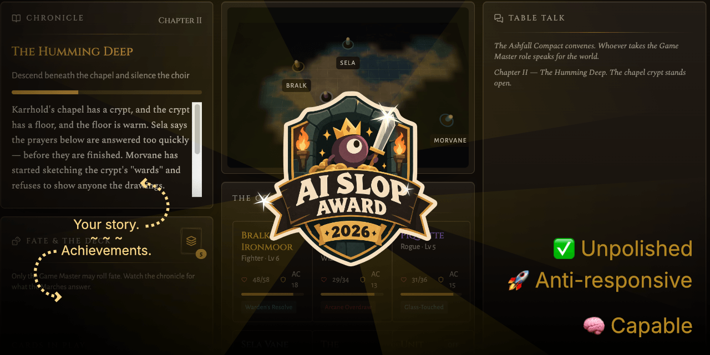
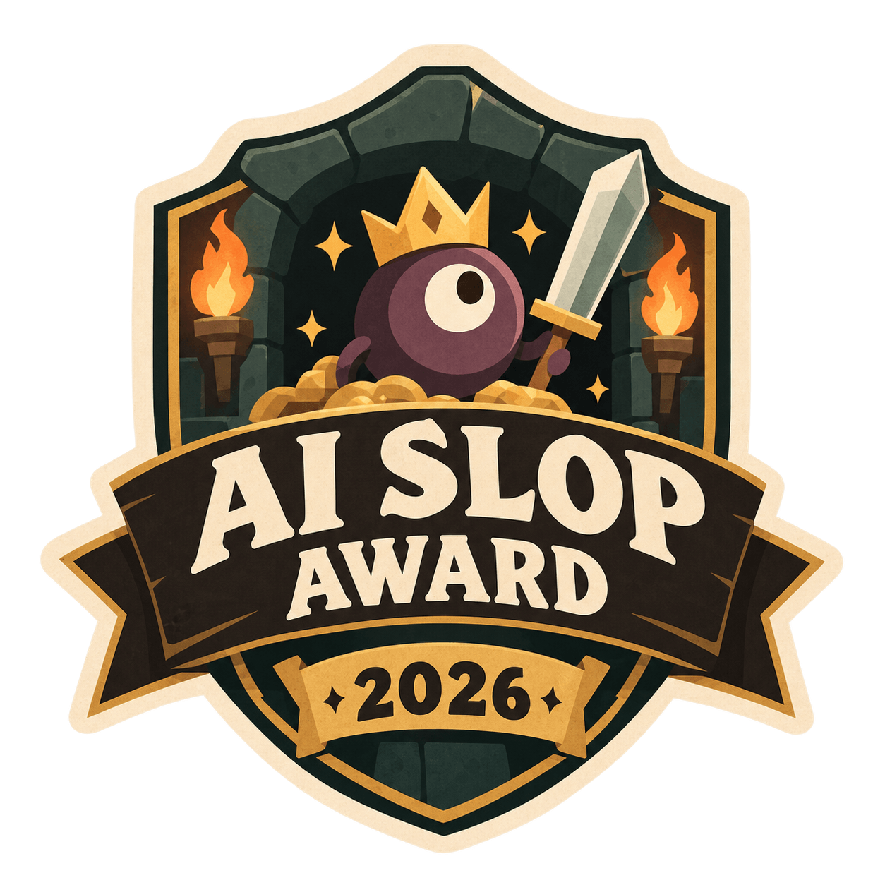

# Web Stack Tech Demo – DnD map

Vibe coding tech demo to explore a variety of tech stacks in a single place.
'Force-fitting' it together to save time, instead of having to create individual projects and use cases.

Try it live: [LOVABLE](https://ccn-test-dnd-dm-map.lovable.app)

---

## Mechanics

Not really much to do/ see – most is not working properly.
The focus is on the tech stack behind the scenes.

> Any persistent data is reset regularly. Do not store anything important here.

---

## Tech Stack

Lovable defaults, with:

- **Frontend:** React + TypeScript
- **Styling/UI:** Tailwind CSS + shadcn/ui
- **Layout:** CSS Grid + CSS Subgrid
- **3D Rendering:** Three.js + custom shader effect
- **Client State:** Zustand
- **Backend/API:** Node.js + server/API routes
- **Realtime:** Native Node.js WebSockets
- **Authentication:** Supabase Auth + OAuth + JWT sessions
- **Database:** Supabase PostgreSQL
- **ORM:** Prisma
- **AI:** OpenAI-compatible API architecture + mock AI provider
- **PWA/Offline:** Service Worker + local persistence + synchronization
- **Drag & Drop:** Modern drag-and-drop library
- **Testing:** Vitest

Documentation: `RESULT.MD`

---

## Disclaimer

> [!TIP]
> 98% AI generated, 1% effort – 1% love

Nothing has been adjusted or polished; nor will be.
This is about stack integration _only_, paired with a randomly chosen visual demo.

---

## Fan goodies

In case you urgently need it for something.

---

_Code by Lovable. Slop award by ChatGPT. README by human._
